# 🖥️ OmniTUI — Modulare Linux-Administration per Terminal UI

> **Entwickler & Administrator:** Tobias Boyke
> **Status:** 🚀 Vollständig Einsatzbereit & Getestet
> **Kompatibilität:**   

---

## 📖 Einführung & Vision

**OmniTUI** ist ein hochgradig modulares, interaktives und professionelles Administrations- und Netzwerkeinrichtungs-System auf Basis von **Whiptail TUI**. Es transformiert komplexe Linux-Systemadministration in eine benutzerfreundliche, fehlerresistente Terminal-Oberfläche.

Das System steuert die gesamte Netzwerkarchitektur (Zentrales Gateway, IP-Forwarding, `nftables` NAT-Masquerading, statisches Routing auf Clients) und erlaubt die Zuweisung von Geräten über ihre spezifischen **ENS-Namen** oder **physikalischen MAC-Adressen** direkt aus der YAML-Datei.

Zusätzlich integriert die Suite **fortgeschrittene Kernel-Tweaks** (Google BBR, TCP Window-Size-Scaling), lokale **DNS-Caching-Resolver**, einen **interaktiven Cronjob-Builder**, ein **Konnektivitäts-Diagnosewerkzeug**, einen **Backup & Restore Manager** sowie eine **NTP-Zeitsynchronisation** für absolut zeitsynchronisierte Protokolle und Logfiles im gesamten Subnetz.

### 🧬 Herkunft

OmniTUI hat sich aus dem **Day 17**-Modul des [Linux-Essentials](https://github.com/BitLC-NE-2025-2026/Linux-Essentials/tree/main/Day_17)-Kursprojekts entwickelt und ist seitdem als **eigenständiges Projekt** weiterentwickelt worden. Das Original-Kursmodul diente als Grundlage für die Architektur und die ersten Module — OmniTUI erweitert und verbessert dieses Fundament seither kontinuierlich.

---

## 📑 Inhaltsverzeichnis
- [🏗️ System-Architektur & Modulstruktur](#️-system-architektur--modulstruktur)
- [⚙️ Zentrale YAML-Konfiguration (config.yaml)](#️-zentrale-yaml-konfiguration-configyaml)
- [📦 Die Modul-Skripte im Detail](#-die-modul-skripte-im-detail)
  - [1. Systemprüfung (sys_check.sh)](#1-systemprüfung-sys_checksh)
  - [2. Dual-DNS Benchmark & Selektor (dns_selector.sh)](#2-dual-dns-benchmark--selektor-dns_selectorsh)
  - [3. System Tuning & Performance (system_tweaks.sh)](#3-system-tuning--performance-system_tweakssh)
  - [4. Cronjob Maker TUI (cron_maker.sh)](#4-cronjob-maker-tui-cron_makersh)
  - [5. Tools & Shell-Branding (tools_installer.sh)](#5-tools--shell-branding-tools_installersh)
  - [6. Desktop Ricing & Premium Eyecandy (desktop_ricing.sh)](#6-desktop-ricing--premium-eyecandy-desktop_ricingsh)
  - [7. System- & Netzwerk-Diagnose (diagnostics.sh)](#7-system---netzwerk-diagnose-diagnosticssh)
  - [8. NTP Zeitsynchronisation & Server (ntp_setup.sh)](#8-ntp-zeitsynchronisation--server-ntp_setupsh)
  - [9. Backup & Restore Manager (backup_manager.sh)](#9-backup--restore-manager-backup_managersh)
  - [10. Subnetz-Scanner (subnet_scanner.sh)](#10-subnetz-scanner--host-discovery-subnet_scannersh)
  - [11. Konfigurations-Editor (config_editor.sh)](#11-interaktiver-konfigurations-editor-config_editorsh)
  - [12. Gemeinsame Bibliothek (common.sh)](#12-gemeinsame-system-bibliothek-commonsh)
- [🚀 Installation & Ausführung](#-installation--ausführung)
- [🧠 LPIC-1 Relevanz & Wissenstest](#-lpic-1-relevanz--wissenstest)

---

## 🏗️ System-Architektur & Modulstruktur

Das System teilt sich in eine zentrale TUI-Hauptsteuerung und dedizierte, modular gekapselte Skripte im Ordner `scripts/` auf:

```mermaid
graph TD
    A["OmniTUI.sh (Hauptmenü Loop)"] --> B["config.yaml (Single Source of Truth)"]
    
    %% Shared library & helpers
    A -.-> CO["scripts/common.sh (Shared Constants & Helpers)"]
    CO -.-> C
    CO -.-> D
    CO -.-> E
    CO -.-> F
    CO -.-> G
    CO -.-> H
    CO -.-> I
    CO -.-> J
    CO -.-> K
    CO -.-> L
    CO -.-> M
    CO -.-> N
    CO -.-> SC
    CO -.-> CE
    
    %% Action Modules
    A --> C["scripts/sys_check.sh (Dependency & Sudoers)"]
    A --> D["scripts/dns_selector.sh (Dual-IP Benchmark)"]
    A --> E["scripts/router_setup.sh (Routing & nftables NAT)"]
    A --> F["scripts/client_setup.sh (Dynamic IP & nmcli config)"]
    A --> G["scripts/services_mgmt.sh (SSH Hardening & systemd)"]
    A --> H["scripts/system_tweaks.sh (BBR, TCP Tuning, Cache, Editor)"]
    A --> I["scripts/tools_installer.sh (Fastfetch, Terminals, OMZ ZSH)"]
    A --> J["scripts/cron_maker.sh (Cronjob-TUI Assistant)"]
    A --> K["scripts/desktop_ricing.sh (GNOME, KDE, Hyprland Rices)"]
    A --> L["scripts/diagnostics.sh (Auto Self-Healing Doctor)"]
    A --> SC["scripts/subnet_scanner.sh (High-Speed Sweep)"]
    A --> M["scripts/ntp_setup.sh (timedatectl & chronyd Sync)"]
    A --> N["scripts/backup_manager.sh (Config tar.gz Backup/Restore)"]
    A --> CE["scripts/config_editor.sh (TUI YAML Parameter Modifier)"]
    
    %% Parsing layer
    CE --> UC["scripts/update_config.py (Write YAML)"]
    D --> UC
    
    C --> PY["scripts/parse_config.py (Read YAML)"]
    E --> PY
    F --> PY
    L --> PY
    CE --> PY
```



---

## ⚙️ Zentrale YAML-Konfiguration (`config.yaml`)

Die Datei `config.yaml` dient als Single Source of Truth für die gesamte Netzwerk-Topologie.

```yaml
global:
  dns_fallback: "1.1.1.1 1.0.0.1"
  domain: "linux.essentials"

router:
  hostname: "srv-rocky"
  interfaces:
    wan:
      name: "ens160"
      mac: "00:0C:29:9E:B3:12"
    lan_a:
      name: "ens161"
      mac: "00:0C:29:9E:B3:26"
      ip: "172.16.7.33/27"
    lan_b:
      name: "ens256"
      mac: "00:0C:29:9E:B3:1C"
      ip: "172.16.7.97/27"

clients:
  - hostname: "srv-deb-01"
    name: "ens192"
    mac: "00:0C:29:9E:B3:3A"
    ip: "172.16.7.42/27"
    gateway: "172.16.7.33"
```

---

## 📦 Die Modul-Skripte im Detail

| Skriptname | Hauptfunktion | LPIC-1 Bezug | TUI-Typ |
| :--- | :--- | :--- | :--- |
| **`OmniTUI.sh`** | Hauptmenü, Navigations-Loop & Config-Viewer | - | Menü (FHD) |
| **`sys_check.sh`** | Sudoers-Härtung, OS-Erkennung & Dependency-Install | 109.4 | Info-Box |
| **`dns_selector.sh`** | Dual-Ping Benchmark & sofortige systemweite Aktivierung | 109.1, 109.4 | Menü (Live-Werte) |
| **`router_setup.sh`** | IP-Forwarding, nmcli Interface-Profile, nftables NAT | 109.1, 110.1 | Status-Box |
| **`client_setup.sh`** | Dynamic card-mapping (MAC/Name) & statische IPs | 109.1, 109.2 | Status-Box |
| **`services_mgmt.sh`**| OpenSSH Härtung & systemd Überwachung | 110.1 | Yes/No & Dashboard |
| **`system_tweaks.sh`**| Google BBR Tuning, TCP/IP Buffer Sizing, DNS-Caching | 109.1, 110.1 | Checklist (FHD) |
| **`tools_installer.sh`**| Installation CLI-Tools, legendäre fastfetch & OMZ ZSH | 109.4 | Checklist (FHD) |
| **`cron_maker.sh`** | Menügeführter, interaktiver Cronjob-Generator | 105.2 | Menü-Assistent |
| **`desktop_ricing.sh`**| r/unixporn Premium Eyecandy, Wallpaper & Visualizer | - | Checklist (FHD) |
| **`diagnostics.sh`** | Automatisierter Diagnosebericht & Konnektivitäts-Check / Doctor | 109.2 | TextBox (Scroll) |
| **`subnet_scanner.sh`**| Paralleler Hochgeschwindigkeits-Subnetz-Scanner (Ping Sweep) | 109.2 | TextBox (Scroll) |
| **`ntp_setup.sh`** | timedatectl & chronyd/systemd-timesyncd Zeitsynchronisation | 108.1 | Menü-Assistent |
| **`backup_manager.sh`**| Systemkonfigurations-Backup & Wiederherstellung | 105.2 | Menü-Assistent |
| **`config_editor.sh`**| Interaktiver YAML-Konfigurations-Parameter-Editor | - | Menü-Assistent |
| **`parse_config.py`** | YAML-Parser ohne Abhängigkeiten zur Systemkopplung (Read) | - | CLI-Hilfstool |
| **`update_config.py`**| YAML-Updater ohne Abhängigkeiten zur Systemkopplung (Write)| - | CLI-Hilfstool |

---

### 1. Systemprüfung (`sys_check.sh`)
* **Sudoers Hinzufügung:** Ist der aktuelle User nicht berechtigt, fragt das Skript nach dem Root-Passwort und fügt ihn der Administratorengruppe (`wheel` bei RHEL/Arch, `sudo` bei Debian) hinzu.
* **Uniformer Paket-Resolver:** Erkennt das OS und installiert fehlende TUI-Abhängigkeiten wie `newt` / `whiptail` und `ping`.

### 2. Dual-DNS Benchmark & Selektor (`dns_selector.sh`)
* **Hintergrund Live-Ping:** Pingt parallel **sowohl die Primary als auch die Secondary IP** von 10 weltbekannten DNS-Providern an (20 Server insgesamt) und berechnet den Mittelwert.
* **Live Latenzanzeige:** Visualisiert die genauen Reaktionszeiten übersichtlich im TUI-Wahlmenü.
* **Sofortige Aktivierung (Live-Override):**
  * Überschreibt sofort das aktive NetworkManager-Schnittstellenprofil (`ipv4.dns`).
  * Sichert `/etc/resolv.conf` und schreibt die neuen Nameserver direkt als System-Override fest.

### 3. System Tuning & Performance (`system_tweaks.sh`)
* **Google BBR Congestion Control:** Modernes TCP/IP Congestion Control für extrem schnelle Übertragungsraten und minimalen Paketverlust.
* **TCP Buffer Tuning:** Skaliert Lese- und Schreib-Buffer des Kernels (`rmem`/`wmem`) auf High-Performance Level.
* **Default-Editor (EDITOR):** Menügeführte, persistente Konfiguration des Standardeditors (`micro`, `nano`, `vim`, `vi`) in `.bashrc` und `.zshrc`.
* **Lokaler DNS-Cache:** Richtet systemweiten Cache via `systemd-resolved` (oder `dnsmasq`) ein. DNS-Antworten werden lokal gespeichert, wodurch Latenzen bei wiederholten Anfragen auf **0 ms** sinken!

### 4. Cronjob Maker TUI (`cron_maker.sh`)
* Nimmt dem Administrator das fehleranfällige manuelle Schreiben von Cron-Zeilen ab.
* Bietet vorgefertigte Intervalle (stündlich, täglich, wöchentlich) und Aufgaben (Sicherheitsupdates, Log-Cleanup, Backup) sowie Custom-Befehle an.
* Trägt die Zeilen nach Validierung sicher in die System-Crontab ein.

### 5. Tools & Shell-Branding (`tools_installer.sh`)
* **Legendäre Fastfetch Config:** Richtet ein schickes, farbkodiertes Terminal-Dashboard mit Unicode-Icons, Hardware-Status und lokalen IP-Adressen unter `~/.config/fastfetch/config.jsonc` ein.
* **Moderne Terminals:** Selektive Co-Installation von `Ghostty` (Zig/GPU-beschleunigt), `Alacritty` (Rust) und `Kitty` samt vollautomatischer Catppuccin Mocha Themes.
* **ZSH & Oh My Zsh:** Richtet die Standard-Shell ein und lädt das `agnoster`-Theme sowie Premium-Plugins:
  * `zsh-autosuggestions` & `zsh-syntax-highlighting`
  * `zsh-completions` & `zsh-history-substring-search`
  * `sudo` (Doppel-ESC fügt ein führendes `sudo` ein) sowie `extract` und `web-search`.
* **Nützliche Aliases:**
  * `ipbrief` -> `ip -br -4 a` (Interface-IPs).
  * `fwlist` -> `sudo nft list ruleset` (Firewall).
  * `ports` -> `sudo ss -tulpen` (Aktive Ports & Sockets).

### 6. Desktop Ricing & Premium Eyecandy (`desktop_ricing.sh`)
* **r/unixporn Edition:** Richtet detailverliebte Rices für **KDE Plasma** (Sweet Cyberpunk, Candy Icons), **GNOME** (Orchis GTK Theme, Blur my Shell, custom Dock) und **Hyprland** (Catppuccin Mocha, custom Waybar-Glow, Rofi, Dunst) ein.
* **Wallpaper Downloader:** Zieht hochauflösende, ästhetische Hintergrundbilder und setzt diese live.
* **Showcase-Tools:** Installiert `cava` (Terminal-Audiospektrum) und `cmatrix` (Matrix Code Rain) für beeindruckende Präsentationen.

### 7. System- & Netzwerk-Diagnose (`diagnostics.sh`)
* Führt automatisiert lokale Schnittstellenprüfungen und Routing-Analysen durch.
* Prüft DNS- und HTTPS-Verbindungen ins Internet.
* Liest die `config.yaml` und führt einen automatisierten Latenz-Sweep zwischen allen Topologie-Hosts durch (Router pingt alle Clients, Clients pingen Gateway).

### 8. NTP Zeitsynchronisation & Server (`ntp_setup.sh`)
* **LPIC-Fokus:** Konfiguriert den Zeitsynchronisationsdienst auf Basis des verfügbaren Clients (`chronyd` auf RHEL/Rocky, `systemd-timesyncd` auf Debian/Arch).
* **Zeitserver-Auswahl:** Bietet eine Auswahlliste an regionalen NTP-Servern (Deutschland-Pool, Europa-Pool, Cloudflare-NTS, Google).
* Richtet die persistente Konfigurationsdatei ein, erzwingt die Synchronisation und gibt Drift- und Zeitstatus aus.

### 9. Backup & Restore Manager (`backup_manager.sh`)
* Archiviert und komprimiert alle durch OmniTUI modifizierten Konfigurationsdateien in einem datierten `.tar.gz`-Archiv unter `/var/backups/omnitui/`.
* Das **Wiederherstellungsmenü** listet alle vorhandenen Backups samt Dateigröße auf und erlaubt das Zurückspielen alter Zustände mit anschließendem automatischen Dienst-Neustart.

### 10. Subnetz-Scanner / Host-Discovery (`subnet_scanner.sh`)
* **Parallele Ping-Sweeps:** Pingt alle IPs im ausgewählten `/27` Subnetz (Netz A oder Netz B) parallel im Hintergrund an.
* **DNS Reverse Resolution:** Versucht automatisch, Online-Hosts über lokale DNS-Auflösungen (`getent hosts`) einem Rechnernamen zuzuordnen.
* **Scan-Berichte:** Generiert einen scrollbaren Whiptail-Bericht über alle aktiven (ONLINE) und freien (offline) IP-Adressen zur einfachen Netzübersicht.

### 11. Interaktiver Konfigurations-Editor (`config_editor.sh`)
* **Live-Parameteranpassung:** Ermöglicht das Bearbeiten wichtiger Parameter aus `config.yaml` direkt aus der Benutzeroberfläche heraus.
* **Zentraler Schreibzugriff:** Nutzt die Python-Bibliothek `update_config.py`, um Werte sauber und ohne Drittanbieter-Abhängigkeiten in der YAML-Struktur zu aktualisieren.

### 12. Gemeinsame System-Bibliothek (`common.sh`)
* **DRY-Konformität:** Bündelt alle globalen Variablen (FHD-Größen, Parser-Pfade) und Hilfsfunktionen (Root-Rechteprüfung, Farb-Logging) an einem einzigen, zentralen Ort.
* **Wartungsfreundlichkeit:** Änderungen an Anzeigegrößen oder Pfaden müssen nur noch in dieser einen Datei vorgenommen werden und vererben sich automatisch auf alle Sub-Module.

---

## 🚀 Installation & Ausführung

```bash
# Repository klonen
git clone https://github.com/T-Boyke/OmniTUI.git
cd OmniTUI

# Hauptsteuerung starten (Rechte werden automatisch vergeben!)
bash OmniTUI.sh
```

> [!NOTE]
> **Automatische Rechtevergabe:** Beim ersten Start vergibt `OmniTUI.sh` automatisch alle nötigen Ausführungsrechte (`chmod +x`) für sämtliche Sub-Skripte und Parser im Hintergrund. Sie müssen keine manuellen Berechtigungsanpassungen vornehmen.

> [!TIP]
> **FHD-Modus:** Die TUI wurde gezielt für Auflösungen ab Full HD (1920x1080) optimiert (Fenstergröße 24x95). Sie bietet dadurch ein erstklassiges, übersichtliches Layout auf modernen Monitoren.

---

## 🧠 LPIC-1 Relevanz & Wissenstest

Dieses Projekt deckt wesentliche Aspekte der LPIC-Prüfungsinhalte ab und festigt Ihr Wissen zur Systemadministration:

<details>
<summary><b>Fragen zu DNS-Konfiguration & Live-Override (Klicken zum Ausklappen)</b></summary>

1. **Welches System-Tool steuert unter Linux die dynamische DNS-Konfiguration und wie überschreibt man diese dauerhaft für ein Interface?**
   <details><summary>Antwort</summary>Unter modernen Distributionen übernimmt der **NetworkManager** die Konfiguration via **`nmcli`**. Ein dauerhafter Override erfolgt mit:
   `sudo nmcli connection modify <Interface> ipv4.dns "1.1.1.1 1.0.0.1" ipv4.ignore-auto-dns yes` gefolgt von `sudo nmcli connection up <Interface>`.</details>

2. **Warum reicht ein Eintrag in `/etc/resolv.conf` bei aktivem systemd-resolved oft nicht dauerhaft aus?**
   <details><summary>Antwort</summary>Weil `/etc/resolv.conf` in modernen Systemen oft ein symbolischer Link auf `/run/systemd/resolve/stub-resolv.conf` oder `/run/systemd/resolve/resolv.conf` ist und vom `systemd-resolved`-Dienst oder dem `NetworkManager` bei jedem DHCP-Event oder Systemstart automatisch überschrieben wird. Ein dauerhafter Override muss daher in der resolved-Konfiguration (`/etc/systemd/resolved.conf`) oder im NetworkManager vorgenommen werden.</details>

</details>

<details>
<summary><b>Fragen zu NTP-Zeitsynchronisation (Klicken zum Ausklappen)</b></summary>

3. **Welcher moderne Zeitsynchronisations-Dienst ist der Standard unter Rocky/RedHat-Systemen und mit welchem CLI-Tool wird er konfiguriert?**
   <details><summary>Antwort</summary>Der Standard ist **`chronyd`** (der Chrony-Daemon). Er wird über das Kommandozeilenwerkzeug **`chronyc`** (z. B. `chronyc sources -v`) überwacht und gesteuert.</details>

4. **Mit welchem Befehl lässt sich die NTP-Zeitsynchronisation im Linux-System aktivieren oder deaktivieren?**
   <details><summary>Antwort</summary>Dies geschieht mit dem Befehl **`sudo timedatectl set-ntp true`** (bzw. `false` zum Deaktivieren). Der Status kann danach über `timedatectl` abgefragt werden.</details>

</details>

<details>
<summary><b>Fragen zu Kernel Tuning & Cron-Schnittstellen (Klicken zum Ausklappen)</b></summary>

5. **Was bewirkt der Sysctl-Befehl `sysctl -w net.ipv4.tcp_congestion_control=bbr`?**
   <details><summary>Antwort</summary>Dieser Befehl ändert den TCP-Staukontroll-Algorithmus (Congestion Control) des Kernels im laufenden Betrieb auf **BBR** (Bottleneck Bandwidth and Round-trip propagation time). BBR ermittelt die optimale Bandbreite und RTT der Leitung und verhindert Datenstau, was die Verbindungsgeschwindigkeit im Subnetz drastisch erhöht.</details>

6. **Wie lautet die Cron-Syntax, um ein Skript jeden Montag um exakt 04:30 Uhr morgens auszuführen?**
   <details><summary>Antwort</summary>Die Syntax lautet:
   `30 4 * * 1 /pfad/zum/skript.sh`
   *(30 = Minute, 4 = Stunde, * = Tag des Monats, * = Monat, 1 = Wochentag [Montag])*</details>

</details>

---

## 📜 Lizenz

Dieses Projekt steht unter der [GNU General Public License v3.0](LICENSE).

---

## 🔗 Ursprung & Weiterführendes

> Dieses Projekt hat sich aus dem **Day 17**-Modul des [Linux-Essentials](https://github.com/BitLC-NE-2025-2026/Linux-Essentials/tree/main/Day_17)-Kursprojekts entwickelt und wird seitdem als eigenständiges Repository gepflegt und erweitert.

---
*Erstellt & gepflegt von Tobias Boyke, Juni 2026.*
